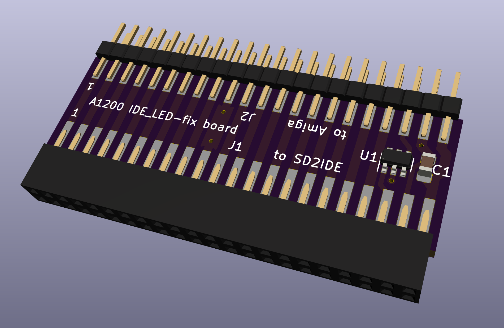
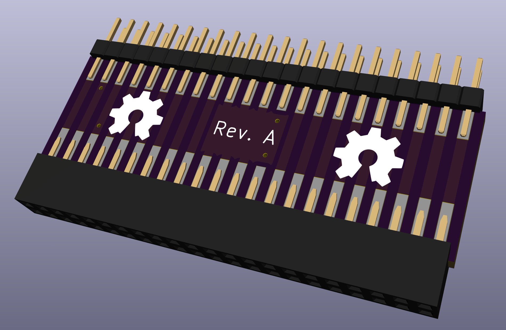
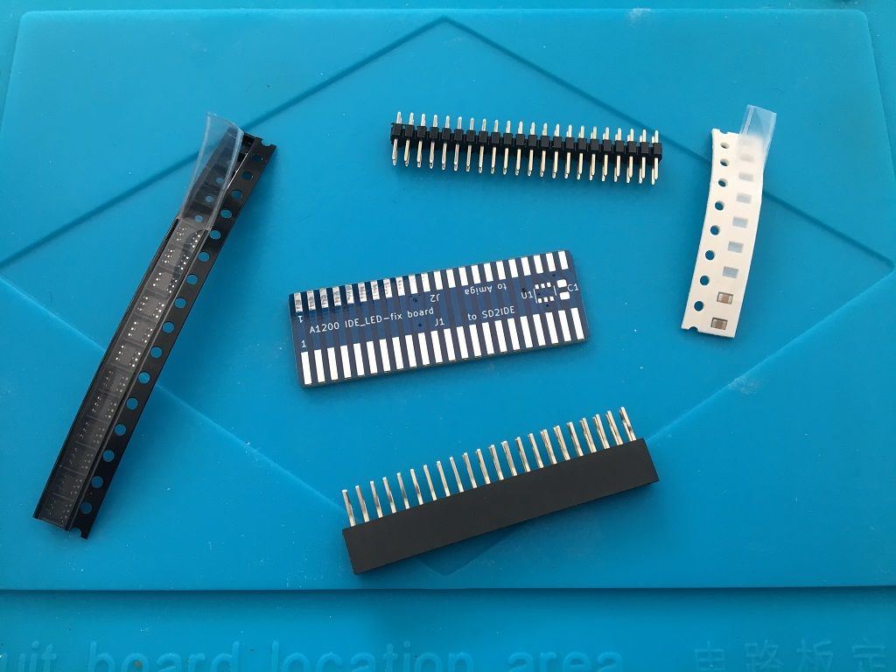
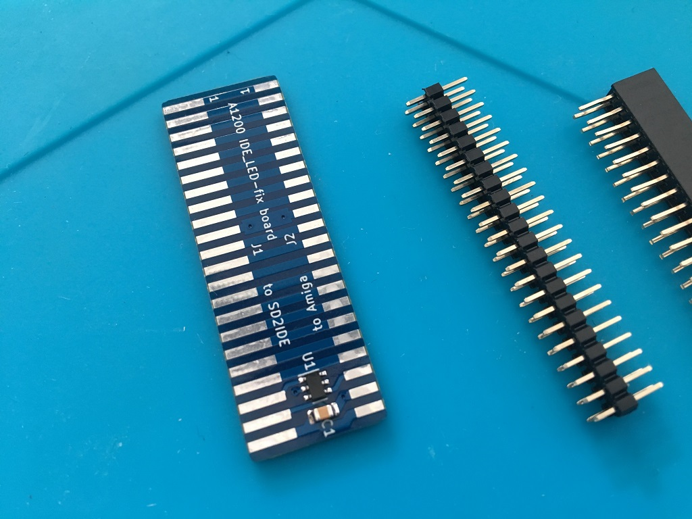
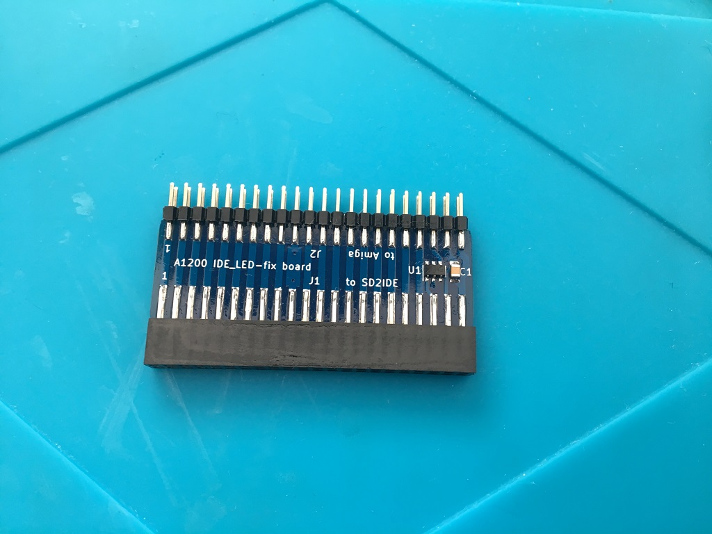
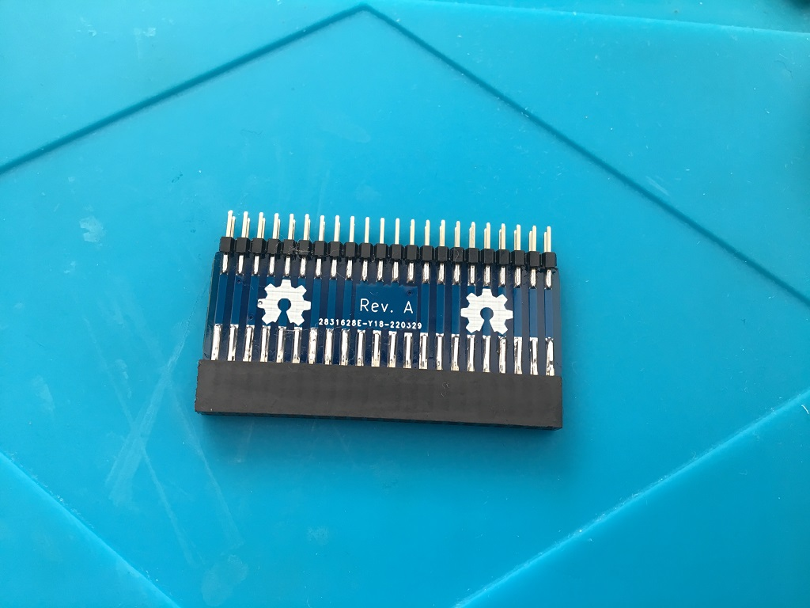
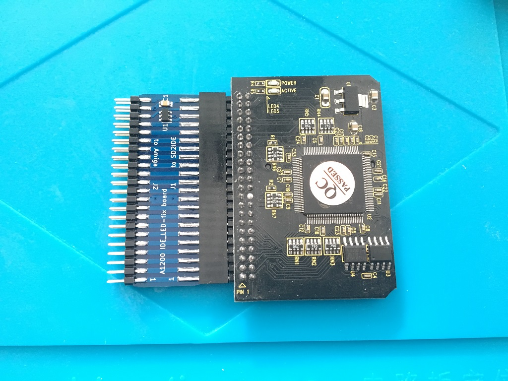
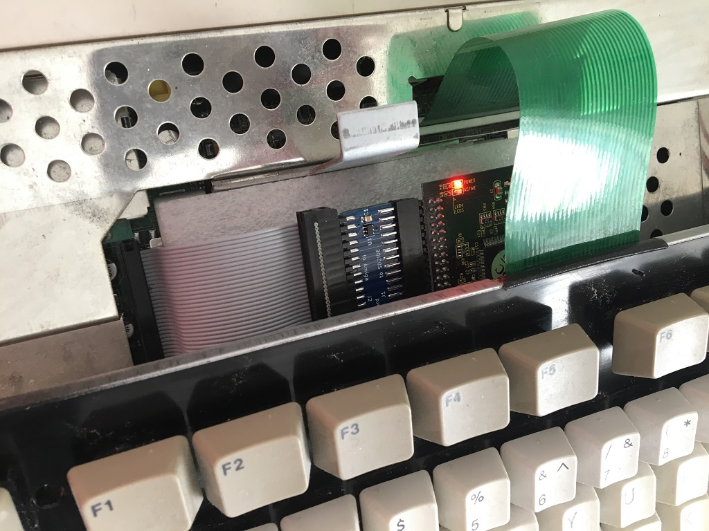

# A1200_IDE_LED_fix_board
A small PCB that fixes the IDE Activity LED always being lit problem on the A1200. 

***

***

***

***

Video:  
https://drive.google.com/file/d/1M3btw3f4qckySm2AM4Yh1fa0WKVMcq9z/view?usp=sharing

***

Symptom: 

    When using the Sintechi (*) SD2IDE-adapter in an A1200 the H.Drive LED is always on. 
    Apart from this, these adapters works perfectly.
[* SD2IDE](https://goughlui.com/2019/02/03/tested-generic-sintechi-fc1307a-based-sd-to-ide-adapter-sd35vc0/)

Cause: 

    The motherboard should turn on the HD LED when the IDE /ACTIVE input is low. 
    However, the transistor on the motherboard controlling the HD LED will switch it on 
    whenever it sees more than ~0.6V difference from 5V on /ACTIVE. 
    As the more recent version of these SD card adapter outputs 3.3V when there is no activity, 
    the LED will never be switched off.

Solution: 

    Using a 74HCT14 IC in-between the pin 39 /Active signal will bump the 3.3V 
    up to 5V since HCT has TTL-level inputs. 2V is enough to detect a High, 
    which will then be shifted up to 5V on the output.
    
Description taken from [here](http://megaburken.net/~patrik/Amiga%20SD%20Adapter%20HD%20LED%20Fix/fix.txt) 

***

BOM Rev. A
---------
Position  | Name/Value   | Package | Notes
-|-|-|-|
U1 | 74HCT2G14 | TSOP-6 | Dual inverting Schmitt trigger
C1 | 0.1uF = 100nF | 0805 | Decoupling capacitor
J1 | PinSocket_2x22_P2.00mm_EdgeMount_SMD | | 
J2 | PinHeader_2x22_P2.00mm_EdgeMount_SMD | |

***

[![CC BY-SA 4.0][cc-by-sa-shield]][cc-by-sa]

This work is licensed under a
[Creative Commons Attribution-ShareAlike 4.0 International License][cc-by-sa].

[![CC BY-SA 4.0][cc-by-sa-image]][cc-by-sa]

[cc-by-sa]: http://creativecommons.org/licenses/by-sa/4.0/
[cc-by-sa-image]: https://licensebuttons.net/l/by-sa/4.0/88x31.png
[cc-by-sa-shield]: https://img.shields.io/badge/License-CC%20BY--SA%204.0-lightgrey.svg
